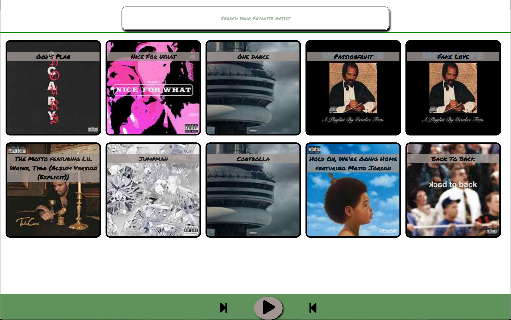

#Music Player WebApp 
 This is a WebApp that is meant to show basketball data in a different way that makes it easier for fanbase to follow.

## Built With
Javascript, HTML, CSS, NAPSTER-API,

## Author
Jose Franny Rodriguez

## License
This project is licensed under the MIT License - see the [LICENSE.md](LICENSE.md) file for details
Frannys-MacBook-Pro:statsupdate Pkt_rguez$ 

